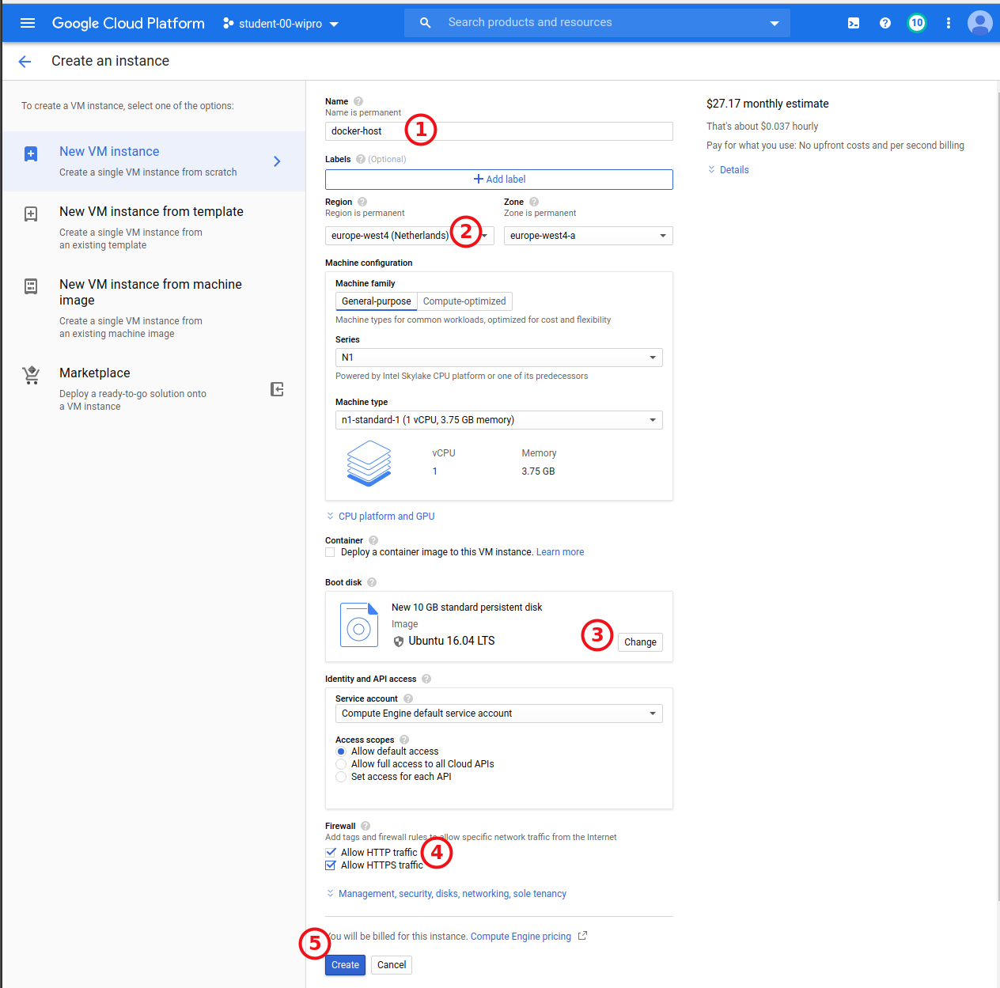
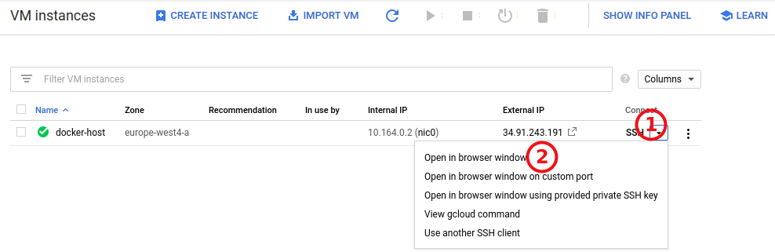

# Create an Ubuntu VM on GCE

1. Go to `Compute Instances` page: https://console.cloud.google.com/compute/instances

2. Create a standard ubuntu VM in your region
  

3. Test the connection trough SSH window/console
   - Or open a new browser window
    
   - execute a command `uname -a` and check if you running Ubuntu

---   

[OPTIONAL] To connect trough directly by your local shell you can install  [gcloud sdk](https://cloud.google.com/sdk/install))
    ```bash
    gcloud auth login
    gcloud config set project student-XX-XXXX
    gcloud compute ssh docker-host --zone europe-west4-a    
    ```
