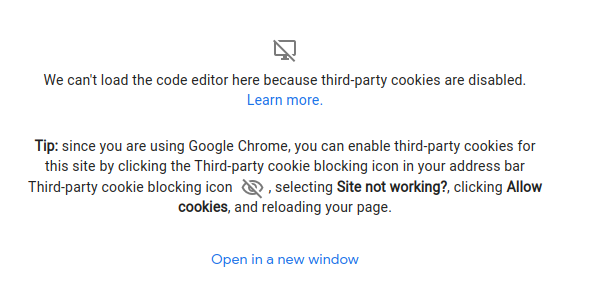

# Setup Environment

## Prepare Google Cloud Shell

### Allow Cookies

If you are in Incognito Mode you may get this message:



Open this dialogue:


Allow Cookies:


### Select Home Directory


## Clone Git Repo

```bash
mkdir -p ~/.tmp
git clone https://github.com/kubermatic-labs/trainings.git ~/.tmp/trainings
cp -r ~/.tmp/trainings/kkp_administration/* .
```

## Set Environment Variables

```bash
echo 'export PROJECT_ID=$(gcloud projects list --format json | jq .[].name | tr -d \")' >> ~/.bashrc
echo 'export DNS_ZONE=$(gcloud dns managed-zones list --format json | jq '.[].name' | tr -d \")' >> ~/.bashrc
echo 'export MAIL=$PROJECT_ID@loodse.training' >> ~/.bashrc
echo 'export SA_NAME=kkp-admin-training' >> ~/.bashrc
echo 'export SA_MAIL=$SA_NAME@$PROJECT_ID.iam.gserviceaccount.com' >> ~/.bashrc
echo 'export DOMAIN=$PROJECT_ID.loodse.training' >> ~/.bashrc
echo 'export REPO_URL=gcr.io/$PROJECT_ID' >> ~/.bashrc
```

### Open a new tab


### Verify Environment Variables are set

```bash
echo $PROJECT_ID
echo $DNS_ZONE
echo $MAIL
echo $SA_NAME
echo $SA_MAIL
echo $DOMAIN
echo $REPO_URL
```

```bash
cd ~/00_setup
```

## Set GCE Credentials

```bash
make get_gcp_sa_key
export GOOGLE_CREDENTIALS=$(cat ~/secrets/key.json)
```

Verify Google Credentials via
```bash
echo $GOOGLE_CREDENTIALS
```

## Create SSH key pair

```bash
ssh-keygen -N '' -f ~/secrets/kkp_admin_training
eval `ssh-agent`
ssh-add ~/secrets/kkp_admin_training
```

## Install tools

```bash
make install_tools
```

## Install bash completion

```bash
source <(kubectl completion bash)
```

Jump > [Home](../README.md) | Next > [Prepare Installation](../01_prepare/README.md)
