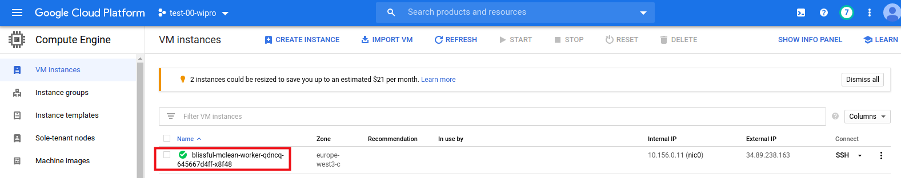
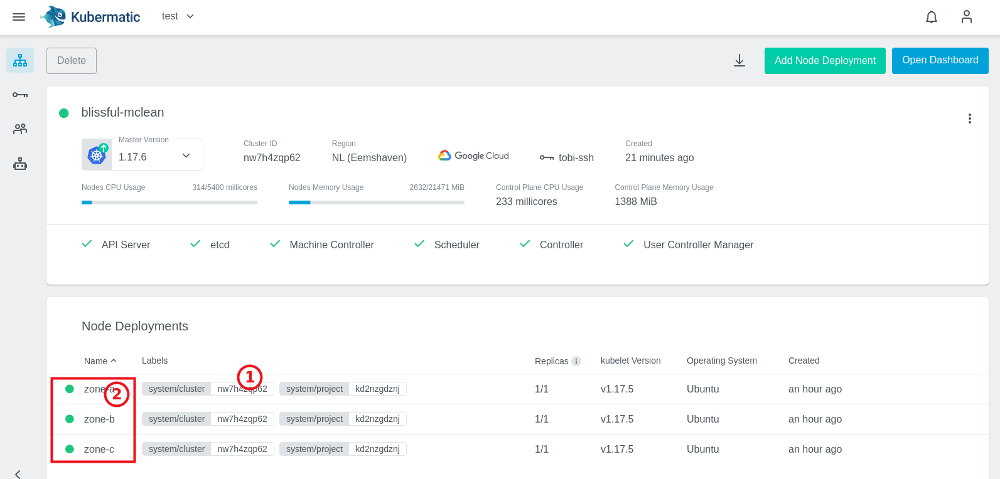

# Create User Cluster

Log in to the Kubermatic UI with your training users, same as we did on [../03-master-dns-setup/README.md](../03-master-dns-setup#login-to-kkp-dashboard)

Follow these tutorials to create a user cluster:

- [Kubermatic Docs > Tutorials > Create Cluster](https://docs.kubermatic.com/kubermatic/master/tutorials_howtos/project_and_cluster_management/#:~:text=create%20cluster)

For the authentication with Google use your already created service account from your [KubeOne Cluster](../01-kubeone-cluster-setup#prepare-secrets) or you can create a service account as described in our [Kubermatic Docs > Requirements > Cloud Provider > GCP](https://docs.kubermatic.com/kubermatic/master/architecture/requirements/support_policy/provider_support_matrix/google_cloud/gcp/).

To add the credentials in the Kubermatic UI, encode it as base64 and copy it:

```bash
cd $TRAINING_DIR # folder 'kkp_fundamentals'
base64 -w 0 ./.secrets/k8c-cluster-provisioner-sa-key.json
```

**IMPORTANT:** Use machine type `n1-standard-2` + replicas of `1`, so that we don't spend unneeded resources.

During the creation of the user cluster you can watch the status in your `kubermatic` seed cluster:

```bash
# get overall cluster status
kubectl get cluster
kubectl describe cluster [cluster-id]

#see the control plane component pods
kubectl get pods -n cluster-[cluster-id]
```

After a few minutes you should see the newly created user cluster. Download the kubeconfig from the UI and connect to it!

Check also from GCE console [GCE - VM instances](https://console.cloud.google.com/compute/instances):


## Create HA setup
By default, every Kubermatic user cluster control plane is deployed as an HA setup, so for this you have nothing to do :-)

### Create HA worker pool

To provide the option of small and big clusters, we think it's best to create the worker nodes based on your needs on compute power and networking. So e.g. to create an HA worker pool spread over 3 availability zones, follow these steps.

1. Open your cluster overview dashboard
2. Create two additional `MachineDeployment` for each missing zone, see [Kubermatic Docs > Tutorials > Machine deployments](https://docs.kubermatic.com/kubermatic/master/examples/manage_workers_node/via_ui/). Use machine type `n1-standard-2` + disk type `pd-ssd` + replicas of `1`, so that we don't spend unneeded resources!
3. Done! Check [GCE - VM instances](https://console.cloud.google.com/compute/instances) and there you should see `3` VMs spread across 3 zones.  

**NOTE:** To identify the different node pools, you should always set meaningful names, like using the zone name in this example:



**NOTE:** To manage the nodes by CRD's you can do exactly the same as you learned in [KubeOne Training > gce/30_setup_ha_worker.md](../../kubeone/gce/30_setup_ha_worker.md)

## Upgrade User Cluster

To upgrade your user cluster, you have two options:

1. Through the UI dashboard: [Kubermatic Docs > Tutorials > Upgrade Cluster](https://docs.kubermatic.com/kubermatic/master/tutorials_howtos/project_and_cluster_management/#:~:text=upgrade%20cluster).
2. By updating the `cluster` object trough the CLI:
    - Execute `kubectl edit cluster [cluster-id]`
    - Change the version field:

      ```yaml
      ...
        exposeStrategy: NodePort
        humanReadableName: blissful-mclean
        oidc: {}
        pause: false
        version: 1.19.9    <<< CHANGE
      status:
      ```

During the upgrade you can watch the rolling release of the containers control plane.

```bash
kubectl get pods -n cluster-[cluster-id]
```

## Delete User Cluster

For the cluster deletion, also you have two options:

1. Through the UI dashboard: [Kubermatic Docs > Tutorials > project_and_cluster_management > Delete Cluster](https://docs.kubermatic.com/kubermatic/master/tutorials_howtos/project_and_cluster_management/#:~:text=delete%20cluster).
2. By deleting the `cluster` object trough the CLI:
   - Execute `kubectl delete cluster [cluster-id]`

After deletion, you will see that:

- All created worker nodes in your [GCE - VM instances](https://console.cloud.google.com/compute/instances) page should be removed.
- Network rules get deleted.
- User Cluster namespace has been deleted `kubectl get ns`.

Jump > [Home](../README.md) | Previous > [Seed DNS Setup](../05-seed-dns-setup/README.md) | Next > [Preset](../07-create-preset/README.md)