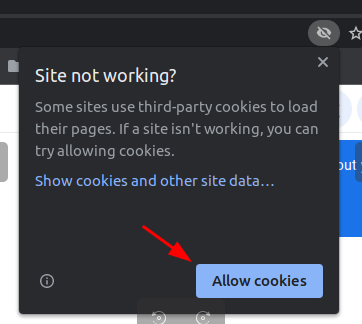
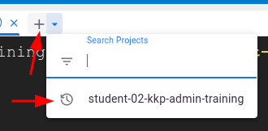

# Setup Environment

## Prepare Google Cloud Shell

### Allow Cookies

If you are in Incognito Mode you may get this message:


Open this dialogue:


Allow Cookies:


### Select Home Directory


## Clone Git Repo

<!-- TODO remove v2 -->
```bash
mkdir -p ~/.tmp
git clone https://github.com/kubermatic-labs/trainings.git ~/.tmp/trainings
cp -r ~/.tmp/trainings/kkp_fundamentals_v2/* .
```

## Set Environment Variables

```bash
cd ~/00_setup
make set_env_vars
```

### Select Project in Terminal



### Verify Environment Variables are set
```bash
echo $PROJECT_ID
echo $MAIL
echo $SA_NAME
echo $SA_MAIL
echo $DOMAIN
```

## Set GCE Credentials

```bash
make get_gcp_sa_key
export GOOGLE_CREDENTIALS=$(cat ~/secrets/key.json)
```

Verify Google Credentials via
```bash
echo $GOOGLE_CREDENTIALS
```

## Create SSH key pair

```bash
ssh-keygen -N '' -f ~/secrets/kkp_admin_training
eval `ssh-agent`
ssh-add ~/secrets/kkp_admin_training
```

## Install tools

```bash
make install_tools
```

<!-- TODO check if kubernetes in .bashrc file works -->

