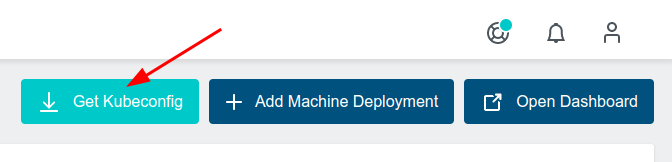

# Create User Clusters

In this lab you will create your first User Cluster.

## Create Cluster within UI

Generate a ServiceAccount holding the GCE Credentials via

```bash
base64 -w0 ~/secrets/google-sa-key.json
```

- Create a new project.
- Click the button `Create Resource / Cluster`
- Within Tab `Provider`
  - Choose Provider `Google Cloud`
  - Choose Datecenter `Frankurt`
- Within Tab `Cluster`
  - Generate a random Cluster name
- Within Tab `Settings`
  - Copy the base64 encoded GCE google-sa-key.json in the field `Service Account`
- Within Tab `Initial Nodes`
  - Generate a random MachineDeployment name
  - Set the number of replicas to 3
  - Choose Disk Type `pd-ssd`
  - Choose Machine Type `n1-standard-2`
  - Check `Preemptible` box
- Within Tab `Applications`
  - do nothing yet
- Within Tab `Summary`
  - Click the button `Create Cluster`

Afterwards it will take ~ 5 minutes your cluster will be usable.

## Verify in Terminal

You will find a new namespace holding all the control plane components of the user cluster

```bash
kubectl get ns

# see all the control plane components of the cluster
watch -n 1 kubectl -n cluster-XXXXX get pods
```

## Connect to the User Cluster

Download the kubeconfig via the following button:



Drag&Drop the downloaded kubeconfig into the Google Cloud Shell.

Connect to the User Cluster

```bash
kubectl --kubeconfig=~/kubeconfig-admin-XXXXX get nodes
```

## Test the resiliency of a User Cluster

Now we will check what happens if a component of the users clusters control plane has an issue.

```bash
# delete one of the etcd nodes
kubectl -n cluster-XXXXX delete pod etcd-0

# the StatefulSet will take care to restart the deleted etcd-0 node
watch -n 1 kubectl -n cluster-XXXXX get pods
```

## Scale the User Cluster

```bash
# everything is declarative with KKP
kubectl get cluster XXXXX -o yaml

# get machinedeployments of the user cluster
kubectl --kubeconfig=~/kubeconfig-admin-XXXXX -n kube-system get machinedeployment

# edit the machine deployment of the user cluster, eg scale the worker nodes to 1 replica
kubectl --kubeconfig=~/kubeconfig-admin-XXXXX -n kube-system edit md MD-NAME

# scale the machine deployment of the user cluster back again to 3
kubectl --kubeconfig=~/kubeconfig-admin-XXXXX -n kube-system scale md MD-NAME --replicas 3

# verify your changes
watch -n 1 kubectl --kubeconfig=~/kubeconfig-admin-XXXXX -n kube-system get md,ms,machine,nodes
```
