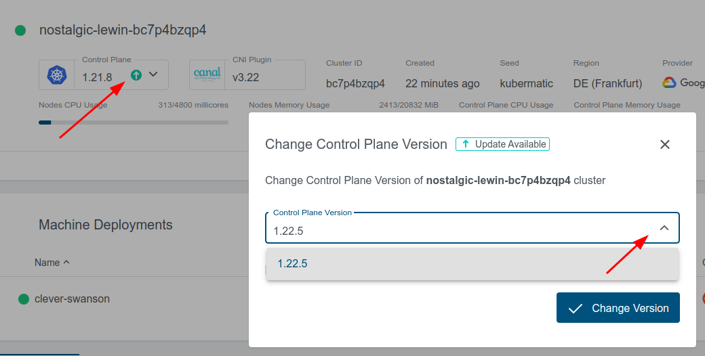

# Upgrade User Clusters

In this lab you will update your user cluster.

## Verify instalable versions

Check on an existing cluster the upgrade possibilities



## Upgrade of User Cluster with UI

We will also verify if there is a downtime during the upgrade process of the deployed applications.

Note, that there are some requirements to the applications to make that possible:

- The Application has to have a `RollingUpdate` Rollout Stategy.
- The Application has to have prober liveness and readiness probes set.
- The Application has to have a prober `terminationGracePeriod`.
- The Application has to scaled > 1.

```bash
# get the external ip address of the ingress-controller
kubectl --kubeconfig ~/kubeconfig-admin-XXXXX -n ingress-nginx get svc ingress-nginx-ingress-nginx-controller

while true; do curl -I http://<EXTERNAL-IP>:80/; sleep 10s; done;
```

Within the UI upgrade your cluster to version `1.29.1`. Also check the checkbox `Upgrade Machine Deployments`.

The control plane of your user cluster will be upgraded very fast, due to it is only about starting new containers. The worker nodes will need about ~ 5 minutes to get updated, due to this is about starting new VMs.

## Manage the available Kubernetes versions

Add the following to the file `kubermatic.yaml` in the `spec` section (mind the proper indent):

```yaml
versions:
  versions:
    - v1.29.1
    - v1.29.4
  default: "1.29.1"
```

Apply the updated Kubermatic configuration

```bash
kubectl apply -f ~/kkp/kubermatic.yaml
```

Afterwards you can verify the choosable Kubernetes Versions for your User Cluster also in the KKP UI.

## Upgrade of User Cluster via Terminal

Now you will update your User Cluster via terminal. Additionally you will verify the availability of our echoserver application.

### Upgrade the Control Plane

```bash
# change the field `spec.version` of the User Cluster to `1.29.4`.
kubectl edit cluster XXXXX

# verify the rollout
watch -n 1 kubectl -n cluster-XXXXX get pods
```

### Upgrade the Worker Nodes

```bash
# change the version of the User Clusters MachineDeployment via the following. Change the version of the field `spec.template.spec.versions.kubelet` to `1.29.4`.
kubectl --kubeconfig ~/kubeconfig-admin-XXXXX -n kube-system edit md XXXXX

# observe the nodes getting upgraded
watch -n 1 kubectl --kubeconfig ~/kubeconfig-admin-XXXXX get md,ms,machine,nodes -A
```
