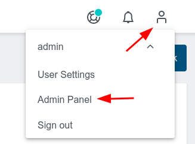

# Templating

In this lab you will learn about templating in KKP.

## Create a Provider Preset

Open the Admin Panel like this:



Choose Provider Presets

Create a Preset

1. On the Preset Tab choose a name, eg `gce`
1. On the Provider Tab choose Google Cloud
1. In the Settings Tab add the base64 encoded GCE google-sa-key.json (you can get it again via `base64 ~/secrets/google-sa-key.json -w0`)

Verify the preset via CLI

```bash
kubectl get preset
```

## Create Cluster Template

1. Create a new cluster via the UI.
1. Make use of the Provider Preset `gce` in the tab `Settings` you have created in the previous step.
1. You can also add Default Applications into your ClusterTemplate in the tab `Applications`.
1. Instead of clicking the button `Create Cluster` click the button `Save Cluster Template` in the tab `Summary`.
1. Give the template a proper name and save it eg on scope `Project`.

Verify the ClusterTemplate via CLI

```bash
kubectl get clustertemplate
```

### Create Cluster using the Provider Preset and the Cluster Template

Within the UI create a cluster via the button `Create Cluster from Template` and make use of the template created in the previous step.
