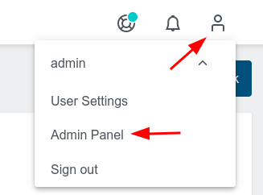

## Create Provider Presets & Cluster Templates

### Create a Provider Preset

Open the Admin Panel like this:

Choose Provider Presets

Create a Preset

1. On the Preset Tab choose a name, eg `gce`
1. On the Provider Tab choose Google Cloud
1. In the Settings Tab add the base64 encoded GCE key.json (you can get it again via `base64 ~/secrets/key.json -w0`)

### Create Cluster Template

See the steps of the section `Create Cluster within UI` on how to create a ClusterTemplate. Make sure to make use of the Provider Preset of the previous step.

<!-- TODO add kubectl commands for getting ProviderPreset and ClusterTemplate -->

### Create Cluster using the Provider Preset and the Cluster Template

Within the UI create a cluster via the button `Create Cluster from Template` and make use of the template created in the previous step.
