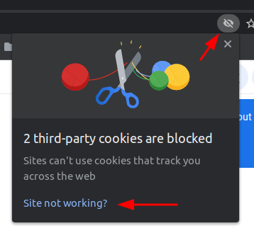
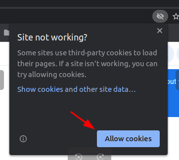
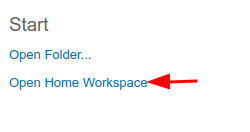
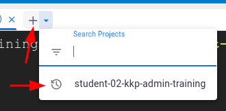

# Kubermatic Kubernetes Platform Administration

## Prepare Google Cloud Shell

### Allow Cookies

If you are in Incognito Mode you may get this message:


Open this dialogue:



Allow Cookies:



### Select Home Directory



### Open a new tab



## Setup Environment

```bash
# get the training materials
mkdir -p ~/.tmp
git clone https://github.com/cloudnativetrainings/trainings.git ~/.tmp
cp -r ~/.tmp/kubermatic_kubernetes_platform_administration/* ~
cp -r ~/.tmp/kubermatic_kubernetes_platform_administration/.trainingrc ~/.trainingrc

# setup the Google Cloud Project in .trainingc file

# create folders
mkdir -p ~/secrets
mkdir -p ~/bin

# create SSH key-pair
ssh-keygen -N '' -f ~/secrets/kkp_admin_training

# get the Google Credentials and add it to the .trainingrc file
touch ~/secrets/google-sa-key.json
source ~/.trainingrc
make get-google-credentials

# re-source the .trainingrc file again
source ~/.trainingrc

# verify the environment
make verify
```

## Fix K1 nodes due to GCP ephemeral nodes

Due to we are using ephemeral nodes on GCP it can happen that the K1 worker nodes get into state `NotReady`. If this happens you have to delete the existing machines. The MachineController will spawn up new worker nodes afterwards.

```bash
# delete all machines
kubectl -n kube-system delete machine --all

# verify new nodes are coming up
kubectl get nodes
```

## Teardown Environment

### Teardown User Clusters

If you have User Clusters you have to delete them.

```bash
# delete all user clusters
kubectl delete clusters --all

# verify no user cluster VMs exist
gcloud compute instances list --format json | jq length
```

### Teardown DNS entries

If you have DNS entries you have to delete them.

```bash
# delete Seed DNS entry
export SEED_IP=$(kubectl -n kubermatic get svc nodeport-proxy -o jsonpath='{.status.loadBalancer.ingress[0].ip}')
gcloud dns record-sets transaction start --zone=$GCP_DNS_ZONE
gcloud dns record-sets transaction remove --zone=$GCP_DNS_ZONE --ttl 60 --type A $SEED_IP --name="*.kubermatic.$GCP_DOMAIN."
gcloud dns record-sets transaction execute --zone $GCP_DNS_ZONE

# delete Master DNS entries
export INGRESS_IP=$(kubectl -n nginx-ingress-controller get service nginx-ingress-controller -o jsonpath='{.status.loadBalancer.ingress[0].ip}')
gcloud dns record-sets transaction start --zone=$GCP_DNS_ZONE
gcloud dns record-sets transaction remove --zone=$GCP_DNS_ZONE --ttl 60 --type A $INGRESS_IP --name="$GCP_DOMAIN."
gcloud dns record-sets transaction remove --zone=$GCP_DNS_ZONE --ttl 60 --type A $INGRESS_IP --name="*.$GCP_DOMAIN."
gcloud dns record-sets transaction execute --zone $GCP_DNS_ZONE
```

### Teardown K1 Cluster

```bash
cd ~/kubeone; kubeone reset --manifest kubeone.yaml -t tf.json -y
cd ~/kubeone; terraform destroy -auto-approve

# verify all machines got deleted 
# now the number of vms should be 0, if not please delete them in the UI https://console.cloud.google.com/compute/instances
gcloud compute instances list --format json | jq length
```

### Teardown Google ServiceAccount

```bash
gcloud iam service-accounts delete $GCP_SA_MAIL --quiet
```
