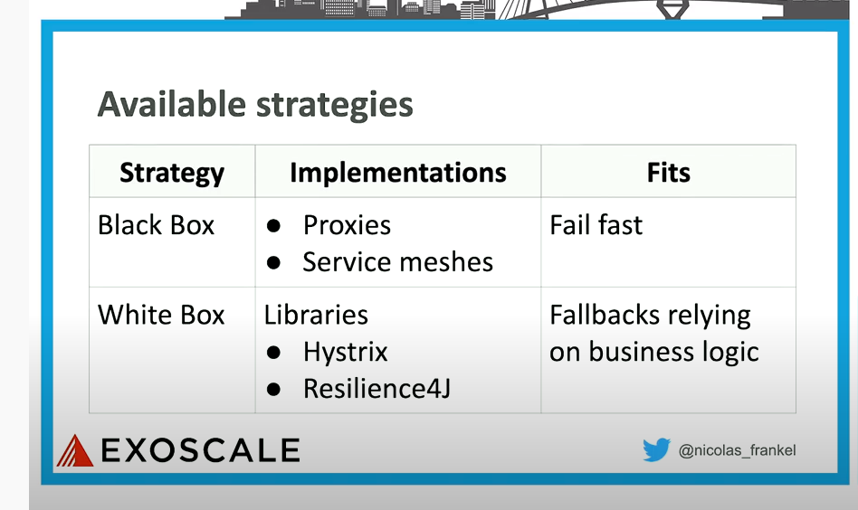
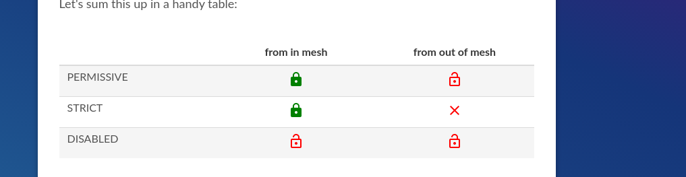

# Servicemesh vs libs



# Drawback of istio Circuit breaker
1. It does not provide any fallback
2. there is no business logic involved on doing decisions

# circuit breaker params
https://ahsan.io/2019-01-09-istio-circuit-breaking/

# mtls 


MeshPolicy versus Policy

policy and meshpolicy are removed since istio 1.6.0
https://github.com/istio/istio/issues/24502


# explain traffic
north-south
east-west


# good to know 

## DestinationRule
Labels apply a filter over the endpoints of a service in the service registry. See route rules for examples of usage.

```bash
kubectl get endpoints --show-labels
```
