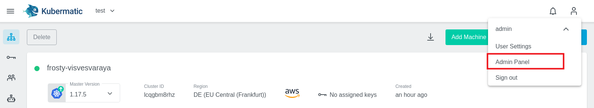
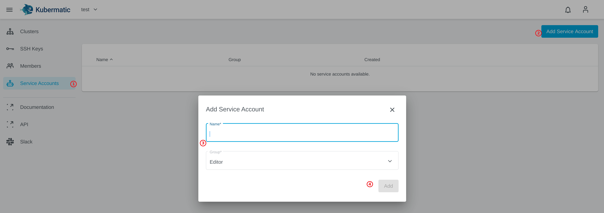

# Kubermatic UI - Admin Features

This chapter should give you a short introduction into some admin features of the Kubermatic UI. The UI itself is stateless, all the changes are stored as objects of the Kubermatic CRDs. As a first step we need to enable the admin UI for your user.

### Give your user Admin rights

```bash
kubectl get users
kubectl edit user XXX-your-user-id-XXX
```
set `admin: true`:
```yaml
apiVersion: kubermatic.k8s.io/v1
kind: User
metadata:
  ...
spec:
  admin: true
  email: student-00@loodse.training
  id: ebb943d88d8303e4cc3470926f5b1e6a8a7e7d1418c984ae9334f3ec_KUBE
  name: student-00
```

You can access the admin panel now, e.g. via `https://kubermatic.YOUR-DNS-ZONE.loodse.training/settings` or directly over the UI menu:


## Set some sane defaults for Kubermatic

In the admin panel you can modify multiple settings. These settings will update your in-cluster configuration object `KubermaticSetting` or `Seed`.

For example, we can set the following values:


The changes will be reflected in the `globalsettings` object of kind `KubermaticSetting`. To ensure that we configure everything as code, we should store the config as `kubermatic.globalsetting.yaml` so that we can manage it as a regular Kubernetes manifest:
```bash
kubectl get kubermaticsettings globalsettings -o yaml --export > kkp-setup/kubermatic.globalsetting.yaml
cat kkp-setup/kubermatic.globalsetting.yaml
```
```yaml
apiVersion: kubermatic.k8s.io/v1
kind: KubermaticSetting
metadata:
  generation: 1
  name: globalsettings
  selfLink: /apis/kubermatic.k8s.io/v1/kubermaticsettings/globalsettings
spec:
  cleanupOptions:
    Enabled: true
    Enforced: false
  clusterTypeOptions: 1
  customLinks: []
  defaultNodeCount: 1
  displayAPIDocs: true
  displayDemoInfo: false
  displayTermsOfService: false
  enableDashboard: true
  enableOIDCKubeconfig: true
  restrictProjectCreation: false
  userProjectsLimit: 0
```

Now is a good time to configure the seed cluster and datacenters. For the purpose of this training just change the location name, to ensure that nothing breaks.


Afterwards store the changed datacenter of the `seed` object for persistence:
```bash
kubectl get seed europe-west -o yaml --export > kkp-setup/seed.europe-west.yaml
cat kkp-setup/seed.europe-west.yaml
``` 
```bash
apiVersion: kubermatic.k8s.io/v1
kind: Seed
metadata:
  annotations:
    kubectl.kubernetes.io/last-applied-configuration: |
      {"apiVersion":"kubermatic.k8s.io/v1","kind":"Seed","metadata":{"annotations":{},"name":"europe-west","namespace":"kubermatic"},"spec":{"country":"EU","datacenters":{"aws-eu-central-1a":{"country":"DE","location":"EU Central (Frankfurt)","spec":{"aws":{"region":"eu-central-1"}}},"gce-eu-west-4":{"country":"NL","location":"Eemshaven","spec":{"gcp":{"region":"europe-west3","regional":true,"zone_suffixes":["a","b","c"]}}}},"kubeconfig":{"name":"seed-kubeconfig","namespace":"kubermatic"},"location":"K1 Cluster"}}
  generation: 1
  name: europe-west
  selfLink: /apis/kubermatic.k8s.io/v1/namespaces/kubermatic/seeds/europe-west
spec:
  country: EU
  datacenters:
    aws-eu-central-1a:
      country: DE
      location: EU Central (Frankfurt)
      spec:
        aws:
          region: eu-central-1
    gce-eu-west-4:
      country: NL
      location: Eemshaven (Lab)
      spec:
        gcp:
          region: europe-west3
          regional: true
          zone_suffixes:
          - a
          - b
          - c
  kubeconfig:
    name: seed-kubeconfig
    namespace: kubermatic
  location: K1 Cluster
```

## REST API

Another option to interact with Kubermatic is the REST API at the endpoint `https://kubermatic.YOUR-DNS-ZONE.loodse.training/rest-api`:

Let's explore the endpoint `/rest-api` via the browser and finish the following tasks:
- List all projects
- Get Details of one of your user clusters

For using the Rest API, you can create a Service Account in your project:


For More information read [Docs > Advanced Service Account](https://docs.kubermatic.com/kubermatic/master/advanced/service_account/)
