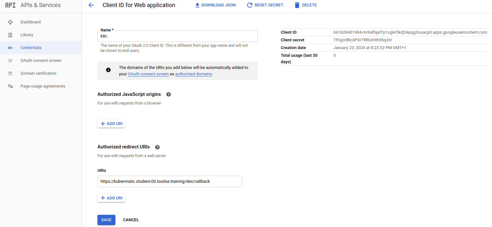

TODO
----

* To create a new user cluster we need to set up a nested seed cluster as the last step:
  - [gce/50_add_seed_cluster.md](gce/50_add_seed_cluster.md)
  - [gce/51_setup_seed_dns.md](gce/51_setup_seed_dns.md)
  - [gce/52_create_user_cluster.md](gce/52_create_user_cluster.md)

## Explore Kubermatic Features

* Add an additional AWS datacenter to try out the multi cloud management capabilities: [aws/60_add_aws_to_datacenter.md](aws/60_add_aws_to_datacenter.md)
* Configure admin settings [65_admin_dashboard.md](65_admin_dashboard.md)
* Set presets for cloud credentials: [66_presets.md](66_presets.md)
* ... more will follow

## Next Steps

* Execute the tutorials: [Kubermatic Docs > Tutorials](https://docs.kubermatic.com/kubermatic/master/tutorials/)
* Get familiar with the advanced config possibilities: [Kubermatic Docs > Advanced](https://docs.kubermatic.com/kubermatic/master/advanced/)
* Execute some typical operational tasks: [Kubermatic Docs > Operation](https://docs.kubermatic.com/kubermatic/master/operation/)

### Kubermatic Installer Script
To deploy the whole stack in a more convenient way, you can use the script [`helper-scripts/kubermatic-deploy.sh`](./helper-scripts/kubermatic-deploy.sh).
With this the different parts of the stack can be deployed in a fast way. This is helpful for deploying a new Kubermatic release and deploying changes due to upgrades or config changes in an easy way:

```bash
./helper-scripts/kubermatic-deploy.sh
```
```
Usage: kubermatic-deploy.sh" (master|seed) path/to/VALUES_AND_CONFIG_FILES path/to/CHART_FOLDER (monitoring|logging|kubermatic|kubermatic-deployment-only)
```
Combine different stack deployments
```bash
### Deploys everything BESIDES monitoring and logging
./helper-scripts/kubermatic-deploy.sh master ./kkp-setup kubermatic-repo/charts kubermatic

### Deploy Logging
./helper-scripts/kubermatic-deploy.sh master ./kkp-setup kubermatic-repo/charts logging

### Deploy Monitoring
./helper-scripts/kubermatic-deploy.sh master ./kkp-setup kubermatic-repo/charts kubermatic-deployment-only monitoring

### Update/Install only kubermatic components (UI, API Server, Controllers)
./helper-scripts/kubermatic-deploy.sh master ./kkp-setup kubermatic-repo/charts kubermatic-deployment-only
```

**NOTE: Our development team is currently working on improving the Kubermatic Operator that will replace more and more parts of the helm based installation. Stay tuned and take a look at our docs from time to time to get the latest info: https://docs.kubermatic.com/kubermatic/master/changelog/**

---


* Configure OAuth client for Dex
  
  To use an OAuth client authentication, in this case our Google account, we change the OpenIDConnect settings in the `oauth` section:
  
  1. Create an `OAuth Client`, **User Type `External`**, **Type `Web application`**, **Application type `Public`**, **Authorized domains:`loodse.training`**, **Redirect URI** `https://kubermatic.YOUR_DNS_ZONE.loodse.training/dex/callback` at https://console.cloud.google.com/apis/credentials/oauthclient. 
  ```bash
  grep 'dex/callback' kkp-setup/values.yaml
  redirectURI: https://kubermatic.student-XX.loodse.training/dex/callback
  ```
  **IMPORTANT NOTE:** First create the `OAuth 2.0 Client IDs`, afterwards edit it and add the `Authorized redirect URIs` (otherwise an error won't let you pass).
  You should get an account similar to this one:
  
  
  
  2. Now copy `Client ID` and `Client secret` to the `oauth` section in the `values.yaml`
  ```bash
    vim kkp-setup/values.yaml
  ```
  ```yaml
    - type: oidc
      id: google
      name: Google
      config:
        # oauth client creation: https://console.cloud.google.com/apis/credentials
        issuer: https://accounts.google.com
        clientID: TODO-GOOGLE-CLIENT-ID
        clientSecret: TODO-GOOGLE-CLIENT-SECRET
        redirectURI: https://kubermatic.student-00.loodse.training/dex/callback
  ```
  ```
  helm upgrade --tiller-namespace kubermatic --install --wait --timeout 300 --values kkp-setup/values.yaml --namespace oauth oauth kubermatic-installer/charts/oauth/      
  
  ### check created resources
  kubectl get pod -n oauth 
  NAME                 READY   STATUS    RESTARTS   AGE
  dex-656f56bf-9r7x7   1/1     Running   1          20s
  dex-656f56bf-zfghr   1/1     Running   0          20s

  kubectl get ingress -n oauth 
  NAME   HOSTS                                        ADDRESS   PORTS     AGE
  dex    kubermatic.student-00.loodse.training             80, 443   30s
  ``` 

* Proceed with the installation of the remaining charts:

  ```bash 
  # indenty aware proxies for monitoring, logging, ...
  helm upgrade --tiller-namespace kubermatic --install --wait --timeout 300 --values kkp-setup/values.yaml --namespace iap iap kubermatic-installer/charts/iap/
  ```
  Let's check if all components are running
  ```
  kubectl get pod,svc -n kubermatic 
  NAME                                        READY   STATUS    RESTARTS   AGE
  pod/controller-manager-v1-bdc574bdd-2g5dc   1/1     Running   0          14m
  pod/controller-manager-v1-bdc574bdd-5ksk6   1/1     Running   0          14m
  pod/kubermatic-api-v1-bb45bc877-bj45h       1/1     Running   0          14m
  pod/kubermatic-api-v1-bb45bc877-jwqd7       1/1     Running   0          14m
  pod/kubermatic-ui-v2-84695d484d-7zxx2       1/1     Running   0          14m
  pod/kubermatic-ui-v2-84695d484d-c8q8r       1/1     Running   0          14m
  pod/master-controller-v1-d46b8986c-5x796    1/1     Running   0          14m
  
  NAME                         TYPE        CLUSTER-IP       EXTERNAL-IP   PORT(S)                       AGE
  service/controller-manager   ClusterIP   10.104.42.163    <none>        8085/TCP                      14m
  service/kubermatic-api       NodePort    10.101.124.171   <none>        80:31369/TCP,8085:32108/TCP   14m
  service/kubermatic-ui        NodePort    10.105.8.224     <none>        80:32186/TCP                  14m
  service/seed-webhook         ClusterIP   10.110.133.136   <none>        443/TCP                       14m
  
  ### ingress rules
  kubectl get ingresses -A
  NAMESPACE    NAME                                         HOSTS                                                     ADDRESS   PORTS     AGE
  default      cert-manager-acme-challenge-kubermatic-all   *                                                                   80        127m
  iap          alertmanager-iap                             alertmanager.kubermatic.student-00.loodse.training             80, 443   15m
  iap          grafana-iap                                  grafana.kubermatic.student-00.loodse.training                  80, 443   15m
  iap          kibana-iap                                   kibana.kubermatic.student-00.loodse.training                   80, 443   15m
  iap          prometheus-iap                               prometheus.kubermatic.student-00.loodse.training               80, 443   15m
  kubermatic   api                                          kubermatic.student-00.loodse.training                          80, 443   16m
  oauth        dex                                          kubermatic.student-00.loodse.training                          80, 443   99m
  ```
  If everything is up and running, we should be able to login to the UI: https://kubermatic.student-00.loodse.training
  
* Next we will install the Kubermatic EFK logging stack:
  ```
  # For logging stack, ensure that all charts are deployed within the logging namespace
  helm upgrade --tiller-namespace kubermatic --install --wait --timeout 300 --values kkp-setup/values.yaml --namespace logging elasticsearch kubermatic-installer/charts/logging/elasticsearch/
  helm upgrade --tiller-namespace kubermatic --install --wait --timeout 300 --values kkp-setup/values.yaml --namespace logging fluentbit kubermatic-installer/charts/logging/fluentbit/
  helm upgrade --tiller-namespace kubermatic --install --wait --timeout 300 --values kkp-setup/values.yaml --namespace logging kibana kubermatic-installer/charts/logging/kibana/
  ```
  
* Finally you can proceed with the installation of the [Kubermatic monitoring stack (Prometheus, Grafana, Alertmanager)](https://docs.loodse.com/kubermatic/master/monitoring/architecture/):

  ```  
  helm upgrade --tiller-namespace kubermatic --install --wait --timeout 300 --values kkp-setup/values.yaml --namespace monitoring prometheus kubermatic-installer/charts/monitoring/prometheus/
  helm upgrade --tiller-namespace kubermatic --install --wait --timeout 300 --values kkp-setup/values.yaml --namespace monitoring node-exporter kubermatic-installer/charts/monitoring/node-exporter/
  helm upgrade --tiller-namespace kubermatic --install --wait --timeout 300 --values kkp-setup/values.yaml --namespace monitoring kube-state-metrics kubermatic-installer/charts/monitoring/kube-state-metrics/
  helm upgrade --tiller-namespace kubermatic --install --wait --timeout 300 --values kkp-setup/values.yaml --namespace monitoring blackbox-exporter kubermatic-installer/charts/monitoring/blackbox-exporter/
  helm upgrade --tiller-namespace kubermatic --install --wait --timeout 300 --values kkp-setup/values.yaml --namespace monitoring grafana kubermatic-installer/charts/monitoring/grafana/
  
  # For the alert manager
  
  helm upgrade --tiller-namespace kubermatic --install --wait --timeout 300 --values kkp-setup/values.yaml --namespace monitoring alertmanager kubermatic-installer/charts/monitoring/alertmanager/
  
  # N.B - Currently the alert-manager will not send any alerts. The target for alerts 
  # can configured there at the values.yaml
  
* cluster backups (etcd and volumes) (requires proper configuration in the chart's values.yaml)
  ```  
  helm upgrade --tiller-namespace kubermatic --install --wait --timeout 300 --values kkp-setup/values.yaml --namespace velero velero kubermatic-installer/charts/backup/velero/
  ```

### Explore Monitoring / Logging Stack

- Kibana: https://kibana.kubermatic.student-00.loodse.training
- Grafana: https://grafana.kubermatic.student-00.loodse.training
- Prometheus: https://prometheus.student-00.loodse.training
- Alertmanager: https://alertmanager.kubermatic.student-00.loodse.training

